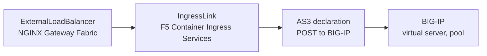

This guide describes how to use an F5 BIG-IP system as the external load balancer for an NGINX Gateway Fabric Gateway.

## Overview

GatewayLink integrates NGINX Gateway Fabric with F5 BIG-IP Container Ingress Services to configure an F5 BIG-IP system as the external load balancer for a Gateway. You describe the desired BIG-IP configuration through the `ExternalLoadBalancer` custom resource.

In this guide, the F5 IPAM Controller allocates the address that BIG-IP listens on, and an iRule preserves the original client address by forwarding it to NGINX using the PROXY protocol.

### How configuration reaches BIG-IP

NGINX Gateway Fabric watches `ExternalLoadBalancer` resources. For each one, it creates an `IngressLink` resource, the custom resource F5 Container Ingress Services uses to describe a Gateway that BIG-IP fronts. The IngressLink carries the settings from the ExternalLoadBalancer spec, along with a label selector that matches the Gateway's data plane Service.

F5 Container Ingress Services watches IngressLink resources. It resolves the selector to the data plane Service, reads its node addresses and NodePorts, and compiles them into an AS3 declaration. It posts that declaration to the AS3 endpoint on BIG-IP, which creates the virtual server and its pool. F5 Container Ingress Services reposts the declaration whenever the endpoints or the IngressLink change, so BIG-IP stays current as Pods come and go.



## Before you begin

You need:

- A Kubernetes cluster.
- An F5 BIG-IP system running version  or later, and an account on it with administrator privileges.
- Network access from the cluster to the BIG-IP system, and from BIG-IP to the cluster node addresses.
- Python 3.14 or later.

This guide installs the AS3 extension, the F5 IPAM Controller, F5 Container Ingress Services, and NGINX Gateway Fabric.

The shell commands in this guide read the following environment variables, so set them once in the shell you work from and the commands can be copied as they appear:

```shell
export BIGIP_ADDRESS="192.0.2.10:443"
export BIGIP_USERNAME="admin"
export BIGIP_PASSWORD="<your-password>"
export IPAM_ADDRESS_RANGE="192.0.2.100-192.0.2.110"
```

- `BIGIP_ADDRESS` is the BIG-IP management address, including the port. BIG-IP listens on 443 by default.
- `BIGIP_USERNAME` and `BIGIP_PASSWORD` are your BIG-IP credentials.
- `IPAM_ADDRESS_RANGE` is a free address range on the BIG-IP subnet, which the F5 IPAM Controller allocates from. You choose this range in [Install the F5 IPAM Controller](#install-the-f5-ipam-controller).

Two more variables are set later, once their values exist:

- `ALLOCATED_ADDRESS` is the virtual server address the F5 IPAM Controller allocates, read from the `IngressLink` status in [Verify the configuration](#verify-the-configuration).
- `NGINX_POD_NAME` is the name of an NGINX Pod, used when reading its logs.

## Prepare BIG-IP

In this section you install the AS3 extension and create the two BIG-IP objects this guide depends on: a partition for F5 Container Ingress Services to own, and an iRule that adds a PROXY protocol header.

### AS3 extension

F5 Container Ingress Services configures BIG-IP by posting AS3 declarations, so AS3 must be installed before anything else. Follow [Downloading and installing the BIG-IP AS3 package](https://clouddocs.f5.com/products/extensions/f5-appsvcs-extension/latest/userguide/installation.html) in the F5 documentation, then return here.

### Partition



### TCP iRule

This guide uses a TCP iRule named `Proxy_Protocol_iRule`:

```text
when SERVER_CONNECTED {
  TCP::respond "PROXY TCP[IP::version] [IP::client_addr] [clientside {IP::local_addr}] [TCP::client_port] [clientside {TCP::local_port}]\r\n"
}
```

The iRule runs on the `SERVER_CONNECTED` event, which fires when BIG-IP opens a connection to NGINX, before any application data is sent. It writes a single PROXY protocol header onto that connection. The header carries the original client address, so NGINX can report it instead of the BIG-IP self-IP address.

To create the iRule:

```shell
curl -sku "$BIGIP_USERNAME:$BIGIP_PASSWORD" -X POST "https://$BIGIP_ADDRESS/mgmt/tm/ltm/rule" \
  -H "Content-Type: application/json" -d '{
    "name": "Proxy_Protocol_iRule",
    "apiAnonymous": "when SERVER_CONNECTED {\n  TCP::respond \"PROXY TCP[IP::version] [IP::client_addr] [clientside {IP::local_addr}] [TCP::client_port] [clientside {TCP::local_port}]\\r\\n\"\n}"
  }'
```

The response describes the new iRule:

```json
{
    "name": "Proxy_Protocol_iRule",
    "fullPath": "/Common/Proxy_Protocol_iRule",
    "apiAnonymous": "when SERVER_CONNECTED { ... }"
}
```

## Install F5 Container Ingress Services

### Install the F5 IPAM Controller

The F5 IPAM Controller allocates the virtual server address from a range you define, so you do not have to pick and track an address by hand.

Allocation is a handoff between the two controllers through a shared `IPAM` resource. F5 Container Ingress Services creates that resource on startup when it is installed with `--ipam=true`. When an `IngressLink` names an IPAM label, Container Ingress Services adds an entry to the resource `spec` requesting an address under that label. The F5 IPAM Controller watches the same resource, takes an address from the range configured for that label, and records the assignment in the resource `status`. Container Ingress Services reads the address from the status and uses it as the virtual server address in the AS3 declaration.

Install the F5 IPAM Controller before Container Ingress Services, so it is watching by the time the first request is made.

Install the `IPAM` custom resource definition:

```yaml
kubectl apply -f - <<EOF
apiVersion: apiextensions.k8s.io/v1
kind: CustomResourceDefinition
metadata:
  name: ipams.fic.f5.com
spec:
  group: fic.f5.com
  names:
    kind: IPAM
    listKind: IPAMList
    plural: ipams
    singular: ipam
  scope: Namespaced
  versions:
    - name: v1
      served: true
      storage: true
      subresources:
        status: {}
      schema:
        openAPIV3Schema:
          type: object
          x-kubernetes-preserve-unknown-fields: true
          properties:
            spec:
              type: object
              x-kubernetes-preserve-unknown-fields: true
            status:
              type: object
              x-kubernetes-preserve-unknown-fields: true
EOF
```

Then install the controller itself:

Choose the address range the F5 IPAM Controller allocates from.

The range must be addresses on the same subnet as the BIG-IP self-IP, and not in use by anything else. To Find the subnet, run the following command:

```shell
curl -sku "$BIGIP_USERNAME:$BIGIP_PASSWORD" "https://$BIGIP_ADDRESS/mgmt/tm/net/self" \
  | python3 -c 'import sys,json;[print(x["name"],x["address"]) for x in json.load(sys.stdin)["items"]]'
```

The output reports each self-IP with its prefix length:

```text
self_1nic 192.0.2.10/24
```

A self-IP of `192.0.2.10/24` means the allocated address must fall within `192.0.2.1` to `192.0.2.254`. Set `IPAM_ADDRESS_RANGE` to a free range inside that subnet.

Add the F5 IPAM Controller Helm repository:

```shell
helm repo add f5-ipam-stable https://f5networks.github.io/f5-ipam-controller/helm-charts/stable --force-update
helm repo update
```

Install the F5 IPAM Controller with an address range:

```shell
helm install f5-ipam-controller f5-ipam-stable/f5-ipam-controller \
  --namespace kube-system \
  --set image.version= \
  --set namespace=kube-system \
  --set rbac.create=true \
  --set serviceAccount.create=true \
  --set args.log_level=DEBUG \
  --set pvc.create=true \
  --set pvc.storage=100Mi \
  --set-string 'args.ip_range=\{"production":"'"$IPAM_ADDRESS_RANGE"'"\}' \
  --wait
```

The `args.ip_range` value maps a pool name to a range of addresses. The pool name `production` is what the `ExternalLoadBalancer` refers to later through its `ipamLabel` field.

Confirm the F5 IPAM Controller is running:

```shell
kubectl get pods -n kube-system -l app=f5-ipam-controller
```

```text
NAME                                  READY   STATUS    RESTARTS   AGE
f5-ipam-controller-79448b4b8f-qmws7   1/1     Running   0          20s
```

### Deploy F5 Container Ingress Services

Install the F5 Container Ingress Services custom resource definitions:



Deploy F5 Container Ingress Services:

```shell
helm repo add f5-stable https://f5networks.github.io/charts/stable
helm repo update

helm install f5-cis f5-stable/f5-bigip-ctlr -n kube-system \
  --set bigip_secret.create=true \
  --set bigip_secret.username="$BIGIP_USERNAME" \
  --set bigip_secret.password="$BIGIP_PASSWORD" \
  --set rbac.create=true \
  --set serviceAccount.create=true \
  --set namespace=kube-system \
  --set args.bigip_url="$BIGIP_ADDRESS" \
  --set args.bigip_partition=k8s \
  --set args.pool_member_type=nodeport \
  --set args.custom_resource_mode=true \
  --set args.insecure=true \
  --set args.log_level=DEBUG \
  --set args.log-as3-response=true \
  --set args.ipam=true
```

These fields must be set according to your own setup:

- `args.bigip_url` must include the port. F5 Container Ingress Services assumes 443, so omitting a non-default port causes connection failures.
- `args.custom_resource_mode=true` is required. Without it, F5 Container Ingress Services never watches `IngressLink` resources.
- `args.pool_member_type` must match the type of the Gateway's Service. Use `nodeport` with `NodePort`, or `cluster` with `ClusterIP`.
- `args.ipam=true` is required for the F5 IPAM Controller to allocate the virtual server address.
- `args.log-as3-response=true` logs the BIG-IP response to each declaration, which is useful for troubleshooting.

Confirm F5 Container Ingress Services reached BIG-IP:

```shell
kubectl logs -n kube-system deploy/f5-cis-f5-bigip-ctlr | grep "authn/login"
```

A successful login is logged as a `200` response.

```text
2026/08/05 14:27:22 [DEBUG] [2026-08-05 14:27:22,539 urllib3.connectionpool DEBUG] https://192.0.2.10:443 "POST /mgmt/shared/authn/login HTTP/1.1" 200 722
2026/08/05 14:27:23 [DEBUG] [2026-08-05 14:27:23,896 urllib3.connectionpool DEBUG] https://192.0.2.10:443 "POST /mgmt/shared/authn/login HTTP/1.1" 200 722
```

No output at all means Container Ingress Services never attempted a login, so check the logs and the BIG-IP address.

## Install NGINX Gateway Fabric



## Setup

In this section you create a Gateway, a **coffee** application with an HTTPRoute, and an `ExternalLoadBalancer` custom resource that puts BIG-IP in front of the Gateway, then send a request through BIG-IP to confirm traffic reaches the application.

### Create the Gateway

Create an `NginxProxy` resource named `gatewaylink-proxy`:

```yaml
kubectl apply -f - <<EOF
apiVersion: gateway.nginx.org/v1alpha2
kind: NginxProxy
metadata:
  name: gatewaylink-proxy
spec:
  rewriteClientIP:
    mode: ProxyProtocol
    trustedAddresses:
      - type: CIDR
        value: 0.0.0.0/0
  kubernetes:
    service:
      type: NodePort
      externalTrafficPolicy: Cluster
    deployment:
      container:
        readinessProbe:
          expose: true
          port: 8081
          path: /nginx-ready
EOF
```

This `NginxProxy` configures the Gateway that references it with the settings BIG-IP depends on:

- `rewriteClientIP.mode: ProxyProtocol` reads the client address from the PROXY protocol header the iRule adds.
- `service.type` sets the type of the Gateway's Service, and must match the F5 Container Ingress Services `pool_member_type`.
- `readinessProbe.expose` puts the readiness port on the Service, and `readinessProbe.path` sets the path the generated health monitor requests. NGINX Gateway Fabric serves its readiness endpoint at `/readyz` by default, while the monitor generated by F5 Container Ingress Services requests `/nginx-ready`, so setting the path here makes the two agree.
- `rewriteClientIP.trustedAddresses` lists the addresses NGINX accepts a client address from.


This example uses `0.0.0.0/0`, which trusts every address. NGINX checks this list against the address on the connection and against the client address inside the PROXY protocol header, and discards the header if either is untrusted, leaving an internal address in the log with no error reported.

For a narrower list, use the subnet of the IP address which the BIG-IP system uses to send traffic to NGINX.


Create a Gateway named `gateway` with an HTTP listener:

```yaml
kubectl apply -f - <<EOF
apiVersion: gateway.networking.k8s.io/v1
kind: Gateway
metadata:
  name: gateway
spec:
  gatewayClassName: nginx
  infrastructure:
    parametersRef:
      name: gatewaylink-proxy
      group: gateway.nginx.org
      kind: NginxProxy
  listeners:
    - name: http
      port: 80
      protocol: HTTP
      hostname: cafe.example.com
EOF
```

F5 Container Ingress Services builds one virtual server per Service port.

Confirm the Gateway is `Accepted` and `Programmed`:

```shell
kubectl describe gateways.gateway.networking.k8s.io gateway
```

Verify the status is `Accepted` and `Programmed`:

```text
Status:
  Conditions:
    Message:               The Gateway is accepted
    Reason:                Accepted
    Status:                True
    Type:                  Accepted
```

### Deploy the application

Create the **coffee** application by copying and pasting the following block into your terminal:

```yaml
kubectl apply -f - <<EOF
apiVersion: apps/v1
kind: Deployment
metadata:
  name: coffee
spec:
  replicas: 1
  selector:
    matchLabels:
      app: coffee
  template:
    metadata:
      labels:
        app: coffee
    spec:
      containers:
      - name: coffee
        image: nginxdemos/nginx-hello:plain-text
        ports:
        - containerPort: 8080
---
apiVersion: v1
kind: Service
metadata:
  name: coffee
spec:
  ports:
  - port: 80
    targetPort: 8080
    protocol: TCP
    name: http
  selector:
    app: coffee
EOF
```

Create an HTTPRoute named `coffee` that attaches to the Gateway and routes `/coffee` to that Service:

```yaml
kubectl apply -f - <<EOF
apiVersion: gateway.networking.k8s.io/v1
kind: HTTPRoute
metadata:
  name: coffee
spec:
  parentRefs:
  - name: gateway
  hostnames:
  - "cafe.example.com"
  rules:
  - matches:
    - path:
        type: PathPrefix
        value: /coffee
    backendRefs:
    - name: coffee
      port: 80
EOF
```

Confirm the application is running and the route is attached:

```shell
kubectl get pods,svc,httproute
```

The output lists **coffee** Pod, the **coffee** Service, and the HTTPRoute:

```text
NAME                          READY   STATUS    RESTARTS   AGE
pod/coffee-7dd75bc79b-cqvb7   1/1     Running   0          77s

NAME             TYPE        CLUSTER-IP     PORT(S)   AGE
service/coffee   ClusterIP   10.43.174.12   80/TCP    77s

NAME                                         HOSTNAMES               AGE
httproute.gateway.networking.k8s.io/coffee   ["cafe.example.com"]    32s
```

### Create the ExternalLoadBalancer

Create an `ExternalLoadBalancer` resource named `gateway-elb`:

```yaml
kubectl apply -f - <<EOF
apiVersion: gateway.nginx.org/v1alpha1
kind: ExternalLoadBalancer
metadata:
  name: gateway-elb
spec:
  targetRefs:
    - group: gateway.networking.k8s.io
      kind: Gateway
      name: gateway
  gatewayLink:
    ipamLabel: "production"
    partition: k8s
    iRules:
      - /Common/Proxy_Protocol_iRule
EOF
```

The `ipamLabel` field tells the F5 IPAM Controller which address range to allocate from. The value must match a pool name in the `args.ip_range` map used when installing the F5 IPAM Controller.

Confirm NGINX Gateway Fabric accepted the resource:

```shell
kubectl describe externalloadbalancers.gateway.nginx.org gateway-elb
```

Verify the status is `Accepted`:

```text
Status:
  Controllers:
    Conditions:
      Last Transition Time:  2026-08-05T02:21:16Z
      Message:               The ExternalLoadBalancer is accepted
      Observed Generation:   1
      Reason:                Accepted
      Status:                True
      Type:                  Accepted
    Controller Name:         gateway.nginx.org/nginx-gateway-controller
```

## Verify the configuration

Confirm the `IngressLink` was written and an address was allocated:

```shell
kubectl describe ingresslink gateway-nginx
```

```text
Status:
  Last Updated:  2026-08-05T02:23:16Z
  Status:        OK
  Vs Address:    192.0.2.100
Events:          <none>
```

F5 Container Ingress Services writes this status after posting the AS3 declaration. A status of `OK` means BIG-IP accepted the declaration, and `vsAddress` is the address the F5 IPAM Controller allocated.

Store that address for the remaining commands:

```shell
export ALLOCATED_ADDRESS=$(kubectl get ingresslink gateway-nginx -o jsonpath='{.status.vsAddress}')
```

Send a request through BIG-IP:

```shell
curl -H "Host: cafe.example.com" http://$ALLOCATED_ADDRESS/coffee
```

The request returns `200 OK` with a response body from the backend application.

```text
Server address: 10.42.0.43:8080
Server name: coffee-7b9578cff9-t7r7v
Date: 05/Aug/2026:14:33:40 +0000
URI: /coffee
Request ID: a2ae0944885fdf99bb5f86038aeae84f
```

Confirm NGINX sees the original client address:

```shell
export NGINX_POD_NAME=$(kubectl get pods -l app.kubernetes.io/name=gateway-nginx -o jsonpath='{.items[0].metadata.name}')
kubectl logs $NGINX_POD_NAME -c nginx | grep coffee
```

The access log records the address of the machine you sent the request from.

## Troubleshooting



## Remove the configuration

Delete the `ExternalLoadBalancer` so F5 Container Ingress Services deletes the objects it created on BIG-IP:

```shell
kubectl delete externalloadbalancer gateway-elb
```

Confirm the virtual servers are gone:

```shell
curl -sku "$BIGIP_USERNAME:$BIGIP_PASSWORD" "https://$BIGIP_ADDRESS/mgmt/tm/ltm/virtual" | python3 -m json.tool | grep fullPath
```

## References

- [Distribute traffic across clusters with F5 BIG-IP](): terminate TLS at BIG-IP and spread traffic across two clusters, with health monitors and iRules.
- [F5 IngressLink documentation](https://clouddocs.f5.com/containers/latest/userguide/ingresslink/): the F5 Container Ingress Services resource that NGINX Gateway Fabric generates.
- [F5 Application Services 3 Extension reference](https://clouddocs.f5.com/products/extensions/f5-appsvcs-extension/latest/refguide/schema-reference.html): the declaration format F5 Container Ingress Services posts to BIG-IP.
- [NGINX Gateway Fabric](https://github.com/nginx/nginx-gateway-fabric): the NGINX Gateway Fabric source, including the `ExternalLoadBalancer` custom resource definitions.
- [F5 Container Ingress Services](https://github.com/F5Networks/k8s-bigip-ctlr): the F5 Container Ingress Services source and custom resource definitions.
- [F5 IPAM Controller](https://github.com/F5Networks/f5-ipam-controller): allocates virtual server addresses.
- [F5 Container Ingress Services configuration parameters](https://clouddocs.f5.com/containers/latest/userguide/config-parameters.html): the full list of deployment options.
- [PROXY protocol specification](https://www.haproxy.org/download/1.8/doc/proxy-protocol.txt): the header format the iRule generates.