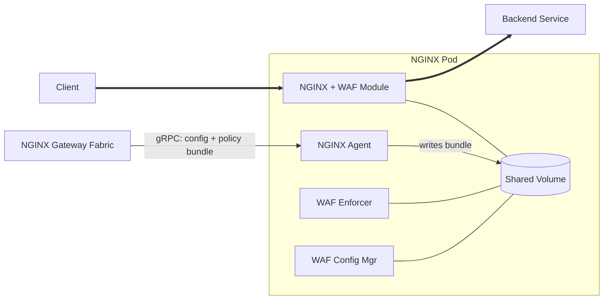

F5 NGINX Gateway Fabric integrates with F5 WAF for NGINX to provide web application firewall protection. WAF policies are compiled externally and deployed to the data plane using the `WAFPolicy` custom resource.

 F5 WAF for NGINX requires NGINX Plus and a separate F5 WAF for NGINX subscription. Contact your F5 sales representative for licensing details. 

---

## Architecture

F5 WAF for NGINX uses a multi-container architecture. When WAF is enabled, each NGINX Pod is extended with two sidecar containers:

- **waf-enforcer**: Enforces WAF policies on incoming traffic.
- **waf-config-mgr**: Manages WAF configuration and distributes policy bundles to the enforcer.

Shared ephemeral volumes connect these containers to the main NGINX container.



---

## Enable WAF on the NginxProxy

WAF is enabled by setting `waf.enable: true` on an `NginxProxy` resource. This instructs NGINX Gateway Fabric to deploy the WAF sidecar containers alongside the NGINX Pod.

You can enable WAF at two levels:

- **All Gateways** -- Set WAF on the GatewayClass-level `NginxProxy` so that every Gateway managed by this NGINX Gateway Fabric instance gets WAF sidecars by default. A per-Gateway `NginxProxy` can override this (for example, to disable WAF on a specific Gateway).
- **Per Gateway** -- Create an `NginxProxy` and reference it from the `spec.infrastructure.parametersRef` field on a Gateway. Only that Gateway gets WAF sidecars.

For details on how GatewayClass and Gateway-level NginxProxy settings are merged, see [Data plane configuration]().

### Enable WAF for all Gateways

To enable WAF at install time, use the **NGINX Plus with WAF** tab in the [Helm install guide](). This sets the WAF-enabled NGINX Plus image (`nginx-plus-f5waf`) and enables WAF on the GatewayClass-level `NginxProxy`, so every Gateway gets WAF sidecars by default.

To disable WAF for a specific Gateway, create a per-Gateway `NginxProxy` with `waf.enable: false` and reference it from that Gateway.

 For additional WAF-related NginxProxy settings (including `disableCookieSeed`, `bundleFailOpen`, and custom WAF container images), see [Configure WAF settings](). 

### Enable WAF per Gateway

If you installed with the standard NGINX Plus image and want WAF on a specific Gateway only, create a per-Gateway `NginxProxy`. You must also set the NGINX image to `nginx-plus-f5waf`, because the standard `nginx-plus` image inherited from the GatewayClass doesn't include the WAF module:

```yaml
apiVersion: gateway.nginx.org/v1alpha2
kind: NginxProxy
metadata:
  name: waf-enabled-proxy
spec:
  waf:
    enable: true
  kubernetes:
    deployment:
      container:
        image:
          repository: private-registry.nginx.com/nginx-gateway-fabric/nginx-plus-f5waf
```

```yaml
apiVersion: gateway.networking.k8s.io/v1
kind: Gateway
metadata:
  name: gateway
spec:
  gatewayClassName: nginx
  infrastructure:
    parametersRef:
      name: waf-enabled-proxy
      group: gateway.nginx.org
      kind: NginxProxy
  listeners:
  - name: http
    port: 80
    protocol: HTTP
```

For the full list of available images, see [Supported container images]().

---

## Policy lifecycle

### Bundles

A WAF bundle is a compiled policy package produced by the [F5 WAF for NGINX compiler](). It contains the security policy, optional logging profile, [attack signatures](), [threat campaign]() data, [bot signatures](), and related metadata. The format lets the WAF engine load and enforce the policy at runtime. Pre-compiling policies into bundles results in faster, more reliable WAF startup: policies are resolved and validated at build time rather than on the running data plane.

### Compilation

WAF policies must be compiled before they can be applied. Compilation takes a JSON policy definition (and optionally [global settings]() such as a cookie seed and [user-defined signatures]()) and produces a `.tgz` bundle. NGINX Gateway Fabric doesn't compile policies. Its role begins with fetching a compiled bundle and deploying it to the data plane.

### Source types

Set the source type using the `spec.type` field on the `WAFPolicy` resource:

| Type   | Description                                                                                       |
|--------|---------------------------------------------------------------------------------------------------|
| `NIM`  | NGINX Instance Manager -- fetched by policy name or UID using the NGINX Instance Manager API      |
| `N1C`  | NGINX One Console -- fetched by policy name or object ID using the NGINX One Console API          |
| `HTTP` | Direct HTTP/HTTPS URL to a compiled bundle file                                                   |
| `PLM`  | Policy Lifecycle Management -- `APPolicy`/`APLogConf` CRDs, fetched from in-cluster storage       |

The `NIM`, `N1C`, and `HTTP` source types reference an externally compiled bundle through `policySource` (and `logSource` for log profiles). They detect updates by polling. The `PLM` source type is Kubernetes-native and event-driven: it references `APPolicy` and `APLogConf` custom resources through `policyRef` (and `logRef`), and doesn't require polling. See [PLM (Policy Lifecycle Management)](#plm-policy-lifecycle-management) below.

For details on configuring each source type, see [Configure policy sources]().

### PLM (Policy Lifecycle Management)

Policy Lifecycle Management (PLM) is a Kubernetes-native policy source. Instead of pointing NGINX Gateway Fabric at an externally compiled bundle, you define your WAF security posture as `APPolicy` and `APLogConf` custom resources in the cluster. The PLM controller watches these resources, compiles them automatically, and stores the resulting bundles in in-cluster S3-compatible storage. NGINX Gateway Fabric fetches the bundles from that storage and deploys them to the data plane.

The following table summarizes how PLM differs from the HTTP, NGINX Instance Manager, and NGINX One Console source types:

| Aspect             | HTTP / NIM / N1C                                | PLM                                                     |
|--------------------|-------------------------------------------------|---------------------------------------------------------|
| Policy definition  | Authored externally (file/Git, NIM, or N1C)     | Authored in-cluster as `APPolicy`/`APLogConf` CRDs      |
| Compilation        | External (compiler CLI/CI-CD, NIM, or N1C)      | Automatic, by the PLM controller                        |
| Bundle storage     | HTTP server, NIM, or N1C                        | In-cluster S3-compatible storage                        |
| `WAFPolicy` fields | `policySource` / `logSource`                    | `policyRef.apPolicyRef` / `logRef.apLogConfRef`         |
| Update detection   | Polling (checksum or conditional GET)           | Event-driven Kubernetes watch (no polling)              |
| Authentication     | Per-`WAFPolicy` credentials Secret              | Cluster-wide PLM storage credentials, set at install    |
| Network access     | External egress to the policy source            | Fully in-cluster                                        |

At runtime, the flow is:

```text
Create APPolicy/APLogConf → PLM compiles and sets status.bundle.state: ready →
NGINX Gateway Fabric detects the ready status via watch → fetches the bundle from
in-cluster storage → deploys to the data plane
```

Changes to an `APPolicy` or `APLogConf` spec trigger recompilation and an automatic re-fetch. No polling is required, and no change to the `WAFPolicy` resource is needed.

When a `WAFPolicy` references an `APPolicy` or `APLogConf` in a different namespace, create a [ReferenceGrant](https://gateway-api.sigs.k8s.io/reference/api-types/referencegrant/) in the target namespace to permit the reference.

 PLM requires the PLM system to be installed in the cluster and PLM storage to be configured on NGINX Gateway Fabric at install time. For a complete walkthrough, see [Get started with F5 WAF for NGINX using PLM](). 

---

## Policy attachment

`WAFPolicy` uses **inherited policy attachment**, following the [Gateway API policy attachment model](https://gateway-api.sigs.k8s.io/reference/policy-attachment/):

- A **Gateway-level** `WAFPolicy` protects all HTTPRoutes and GRPCRoutes attached to that Gateway automatically. New routes inherit protection without any additional configuration.
- A **Route-level** `WAFPolicy` can be applied to a specific HTTPRoute or GRPCRoute to override the Gateway-level policy for that route.
- More specific (route-level) policies take precedence over less specific (gateway-level) policies. The route-level policy completely replaces the gateway-level policy for that route. There's no merging.
- Only one `WAFPolicy` may target a given resource at a given level. If two policies target the same Gateway or Route, the second is rejected with `Accepted=False` and reason `Conflicted`.

```text
Gateway-level WAFPolicy → HTTPRoute (inherited automatically)

Route-level WAFPolicy   → Overrides Gateway-level for that route only
```

 GRPCRoutes are protected in the same way as HTTPRoutes. To target a GRPCRoute, set `kind: GRPCRoute` in the `targetRefs` field. Built-in gRPC log profiles (`log_grpc_all`, `log_grpc_blocked`, `log_grpc_illegal`) are available for gRPC-specific security logging. 

---

## See also

- [Get started with F5 WAF for NGINX]()
- [Get started with F5 WAF for NGINX using PLM]()
- [Configure policy sources (NGINX Instance Manager, NGINX One Console, and HTTP)]()
- [Configure WAF settings]()
- [WAFPolicy and NginxProxy API reference]()
- [F5 WAF for NGINX documentation]()
